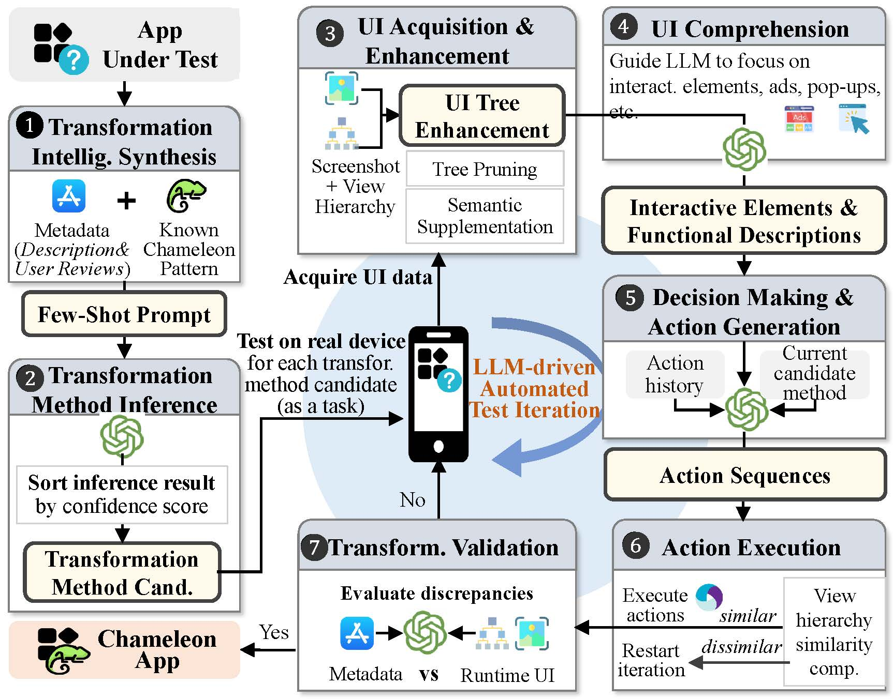

# ChameleoScan

This repository contains the source code of ChameleoScan proposed in our paper:

## Our paper

**ChameleoScan: Demystifying and Detecting iOS Chameleon Apps via LLM-Powered UI Exploration** (NDSS 2026, DOI: 10.14722/ndss.2026.241906)

Available at [NDSS 2026 official site](https://www.ndss-symposium.org/ndss-paper/chameleoscan-demystifying-and-detecting-ios-chameleon-apps-via-llm-powered-ui-exploration/).

```bibtex
@inproceedings{chameleoscan,
  title     = {{CHAMELEOSCAN: Demystifying and Detecting iOS Chameleon Apps via LLM-Powered UI Exploration}},
  author    = {Lin, Hongyu and Hu, Yicheng and Xu, Haitao and Lu, Yanchen and Ren, Mengxia and Hao, Shuai and Yue, Chuan and Li, Zhao and Zhang, Fan and Jiang, Yixin},
  booktitle = {Proceedings of the 33rd Network and Distributed System Security Symposium (NDSS 2026)},
  year      = {2026},
  doi       = {10.14722/ndss.2026.241906},
}
```

## Abstract

Chameleon apps evade iOS App Store review by presenting legitimate  functionality during submission while transforming into illicit variants post-installation. While prevalent, their underlying transformation  methods and developer-user collusion dynamics remain poorly understood.  Existing detection approaches, constrained by static analysis or  metadata dependencies, prove ineffective against hybrid implementations, novel variants, or metadata-scarce instances. To address these  limitations, we establish a curated dataset of 500 iOS Chameleon apps  collected through covert distribution channels, enabling systematic  identification of 10 categories of distinct transformation patterns  (including 4 previously undocumented variants). Building upon these  findings, we present ChameleoScan, the first LLM-driven automated UI  exploration framework for reliable Chameleon app verification. The  system maintains local decision interpretability while ensuring global  detection consistency through its core innovation - predictive metadata  analytics, semantic interface comprehension, and human-comparable  interaction strategies. Comprehensive evaluation on 1,644 iOS apps  demonstrates operational efficacy (9.85% detection rate, 92.59%  precision), with findings formally acknowledged by Apple. Implementation and datasets are available at https://github.com/ChameleoScan.


## Design




## Structure

#### Files you may concern

- ```./cached/```: Place cache of **IPA files**, **app store metadata** and **framework running results**.

- ```app.py```: The **main entrance point** of the framework.
- ```benchmarking.py```: **View** **cached** framework **running results**.
- ```BATCH_TASKS.txt```: **Bundle IDs** for apps **pending test**.
- ```appium.bat```: Launch **Appium server**.
- ```tiproxy.bat```: **Port forwarding** **SSH**, **Frida**,  **Appium**, and **ZXTouch** ports from phone.
- ```xcuitest.bat```: Launch **WebAgentDriver** in phone.
- ......

#### Core Components

- ```app.py```: **Workflow** of **runtime context control**.

- ```app_window.py```: **Workflow** of the **iteration**.
- ```gpt_cls.py```: **Interactions** with the **LLM** (GPT-4o).
- ```ui_cls.py```: **Postprocess** of **runtime UI**.
- ......


## Prerequisites for running

#### Hardware

1. A **Jailbroken** **iPhone** device with **iOS version 14.x** (not necessarily)

2. A **macOS** PC to build **WebAgentDriver**
3. A preferably **Windows** PC to **run the framework**

#### iPhone device setup

1. **Install** **Cydia** and **AppSync** to install decrypted IPA files. (Or **login** your **Apple ID** instead.)

2. **Install** **OpenSSH**, **Frida**, **AFC2**, and **ZXTouch** tweaks (formerly **IOS13-SimulateTouch**).
3. **Build and deploy** **WebAgentDriver** (as **Appium XCUITest Driver**).
4. **Connect** it to the **Host** **PC**.

#### Host PC setup (Windows as example)

1. **Install** **Python 3.11+**, **Node.js 22+**.

2. **Install** **iTunes** or **Apple Mobile Device Service**, make sure your iPhone device is recognizable.
3. Set up a Python **Virtual Environment** (preferably) and install ```requirements.txt```.
4. Set up **Appium** by installing **dependencies** in ```package.json```.
5. Refer to [issue1](https://github.com/alibaba/tidevice/issues/277#issuecomment-1757065698) and [issue2](https://github.com/alibaba/tidevice/issues/377) to **fix tidevice** XCUITest startup issues.
6. **Replace** the default bundle id ```com.1xample.WebDriverAgentRunner.xctrunner``` in ```xcuitest.bat``` into your manually deployed one.
7. **Replace** ```DEVICE_VERSION```, ```DEVICE_UDID``` (maybe include ```STATUS_BAR_PIXELS``` indicating the status bar height) in ```app.py``` into the correct value of your device.
8. **Replace** ```YOUR_API_KEY_HERE``` in ```gpt_cls.py``` into your OpenAI API key.
9. **Train** an **EfficientNet-B0 model** over [rico-semantics](https://github.com/google-research-datasets/rico_semantics/) dataset, and save the model to ```best_model.pth```. See ```train_rico_dataset.py``` and ```cnn_cls.py``` for related code.

#### Running the framework

1. Put your **IPA file** ```bundleid-version-appid-0.ipa``` (same format as ```ipatool-py```), **app store metadata** ```bundleid.json``` (name, category, description) and **user reviews** ```bundleid.comments.json``` into the ```cached``` directory (see examples).

2. Put **Bundle IDs** into ```BATCH_TASKS.txt```.
3. **Run** ```appium.bat```, ```tiproxy.bat```, ```xcuitest.bat``` or you may manually launch these services.
4. **Run** ```app.py``` and see the magic happens!
5. **Run** ```benchmarking.py``` to view your running results at any time.


## Acknowledge

...